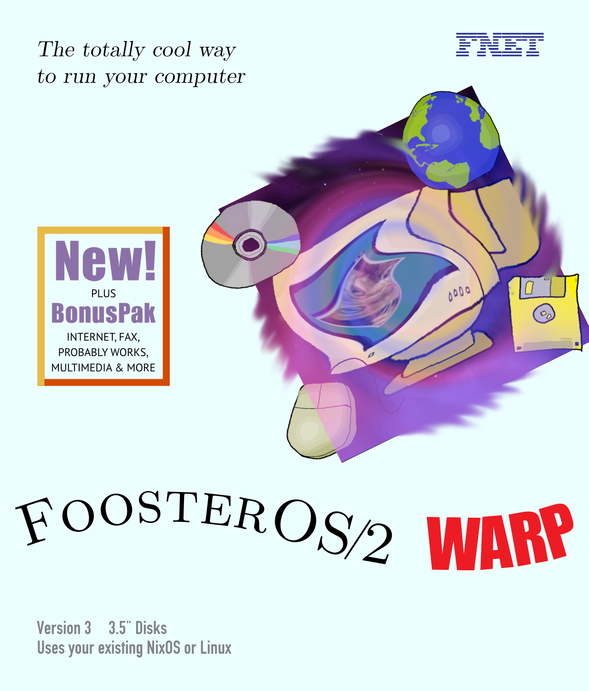

# FoosterOS/2 Warp

_The totally cool way to run your computer_

Feel free to take any pieces in this repository that you like! Please don't try to use this whole thing, though, as it is horrifically custom and specific to myself.


[](https://www.os2world.com/wiki/images/7/7f/52H3800-004.jpg)


## Installation

1. Boot [NixOS minimal install media](https://channels.nixos.org/nixos-unstable/latest-nixos-minimal-x86_64-linux.iso).
2. Add installation dependencies and binary cache.
    ```
    nix-env -iA nixos.{bc,git,cachix}
    cachix use -m user-nixconf foosteros
    ```
3. Partition the disks with at least an EFI System Partition and preferably root and swap in an encrypted LVM.
    ```
    sgdisk -og /dev/sda
    sgdisk -n 1:0:+512M -c 1:esp -t 1:ef00 /dev/sda
    sgdisk -n 2:0:0 -c 2:nixos -t 2:8e00 /dev/sda

    mkfs.fat -F32 -n esp /dev/disk/by-partlabel/esp

    cryptsetup luksFormat /dev/disk/by-partlabel/nixos
    cryptsetup open /dev/disk/by-partlabel/nixos nixos

    pvcreate /dev/mapper/nixos
    vgcreate nixos /dev/mapper/nixos
    lvcreate -L "$(echo 'scale = 2;' "$(vgs -o vg_size --noheadings --units g --nosuffix nixos)" - "$(echo 'scale = 0;' '(' "$(grep -F MemTotal: /proc/meminfo | awk '{print $2}')" + 1024 '*' 1024 ')' / '(' 1024 '*' 1024 ')' | bc)" | bc)"g -n root nixos
    mkfs.btrfs -L root /dev/mapper/nixos-root
    lvcreate -l 100%FREE -n swap nixos
    mkswap -L swap /dev/mapper/nixos-swap
    ```
4. Mount partitions under /mnt.
    ```
    swapon /dev/disk/by-label/swap
    mkdir -p /mnt
    mount /dev/disk/by-label/root /mnt

    ## Create persistent store layout if used.
    # btrfs subvolume create /mnt/state
    # btrfs subvolume create /mnt/persist
    # btrfs subvolume create /mnt/nix
    # btrfs subvolume create /mnt/root
    # btrfs subvolume set-default /mnt/root
    # umount /mnt
    # mount -o subvol=/root /dev/disk/by-label/root /mnt
    # mkdir -p /mnt/nix
    # mount -o subvol=/nix /dev/disk/by-label/root /mnt/nix
    # mkdir -p /mnt/persist
    # mount -o subvol=/persist /dev/disk/by-label/root /mnt/persist
    # mkdir -p /mnt/state
    # mount -o subvol=/state /dev/disk/by-label/root /mnt/state

    mkdir -p /mnt/boot
    mount /dev/disk/by-label/esp /mnt/boot
    ```
5. Make parent directories and clone this repository into /mnt/etc/nixos.
    ```
    mkdir -p /mnt/etc
    git clone https://github.com/lilyinstarlight/foosteros.git /mnt/etc/nixos
    ```
6. Run nixos-install for the target host.
    ```
    ## Install SSH key for host (for sops secret decryption on activation).
    # mkdir -p /mnt/state/etc/ssh
    # cp ssh_host_{rsa,ed25519}_key{,.pub} /mnt/state/etc/ssh/
    # chmod u=rw,go= /mnt/state/etc/ssh/ssh_host_{rsa,ed25519}_key

    ## Copy repository into persistent store if used.
    # mkdir -p /mnt/state/etc
    # cp -a /mnt/etc/nixos /mnt/state/etc/

    nixos-install --flake '/mnt/etc/nixos#minimal' --no-channel-copy  # use --no-root-password as well for systems without mutable users
    ```
7. Reboot into the new system.
    ```
    systemctl reboot
    ```

Your FoosterOS/2 Warp system is setup and ready to go!
